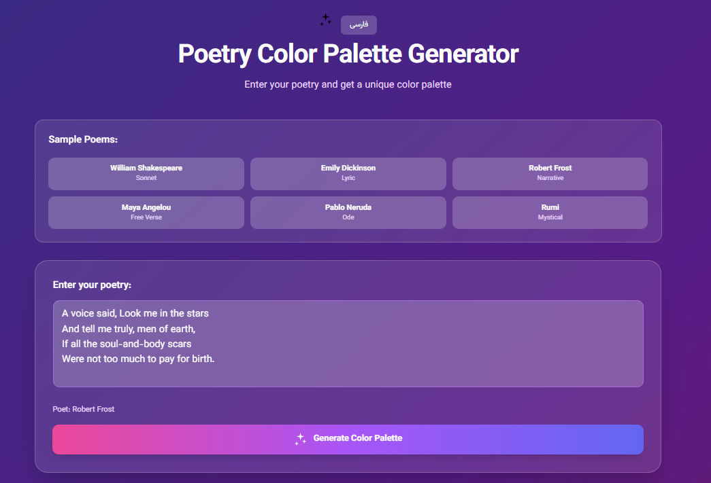
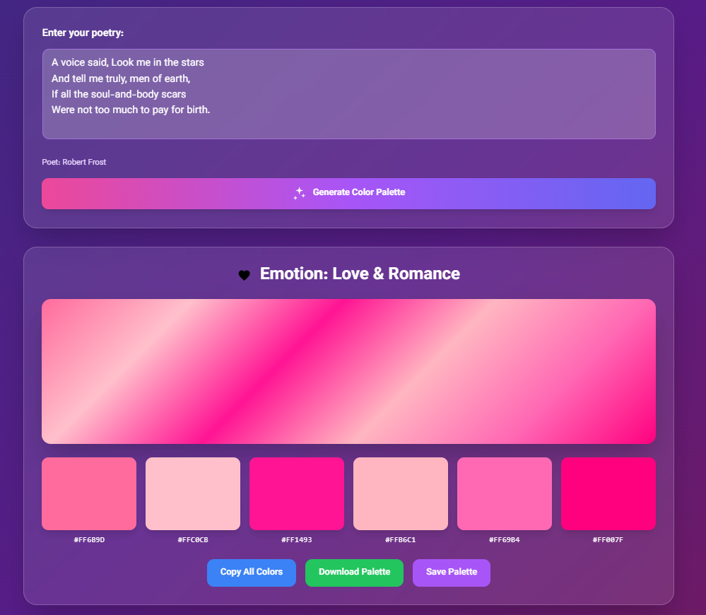
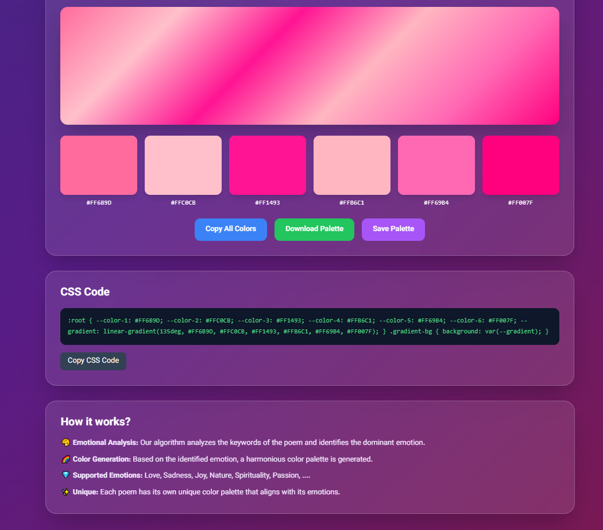

# 🎨 Poetry Color Palette Generator API

<div align="center">


**A multilingual NestJS API that analyzes poetry and generates unique color palettes based on emotional content**

[Features](#features) • [Installation](#installation) • [API Documentation](#api-documentation) • [Usage](#usage) • [Architecture](#architecture)

</div>

---

## 📖 Overview

This innovative API transforms poetry into beautiful color palettes by analyzing the emotional content of verses. Supporting both Persian (Farsi) and English, it uses sophisticated emotion detection algorithms to map feelings to harmonious color schemes.

### ✨ Key Features

- 🌍 **Multilingual Support**: Persian (فارسی) and English
- 🎭 **Emotion Detection**: Advanced NLP for emotional analysis
- 🎨 **Smart Color Generation**: Emotion-based palette creation
- 📊 **Comprehensive API**: RESTful endpoints with Swagger docs
- ⚡ **High Performance**: Built-in caching and rate limiting
- 🏗️ **Enterprise Architecture**: Modular NestJS structure
- 🔒 **Type Safety**: Full TypeScript implementation
- 📝 **Poet Database**: Famous poets from multiple cultures

## 🚀 Features

### Emotion Categories

**Persian Poetry:**

- ❤️ عشق و محبت (Love & Romance)
- 🌙 غم و اندوه (Sadness & Sorrow)
- ☀️ شادی و نشاط (Joy & Happiness)
- 🍃 طبیعت (Nature)
- ✨ معنویت و عرفان (Spirituality)
- 🍷 می و باده (Wine & Intoxication)

**English Poetry:**

- ❤️ Love & Romance
- 🌙 Sadness & Sorrow
- ☀️ Joy & Happiness
- 🍃 Nature
- ✨ Spirituality
- 🔥 Passion & Intensity

### NestJS Advanced Features Used

- **Dependency Injection**: Clean, testable architecture
- **Decorators**: Type-safe API definitions with class-validator
- **Pipes**: Request validation and transformation
- **Guards**: Rate limiting with @nestjs/throttler
- **Interceptors**: Caching with @nestjs/cache-manager
- **Modules**: Organized feature-based structure
- **Swagger Integration**: Auto-generated API documentation
- **Config Module**: Environment-based configuration

## 📦 Installation

### Prerequisites

- Node.js >= 18.x
- npm or yarn

### Setup

```bash
# Clone the repository
git clone https://github.com/mas76nrm/poetry-color-palette-generator.git
cd poetry-color-palette-generator

# Install dependencies
npm install

# Create environment file
cp .env.example .env

# Start development server
npm run start:dev
```

The API will be available at `http://localhost:3000`

## 🔧 Configuration

Edit `.env` file:

```env
PORT=3000
NODE_ENV=development
CORS_ORIGIN=*
THROTTLE_TTL=60000
THROTTLE_LIMIT=20
CACHE_TTL=300
CACHE_MAX=100
```

## 📚 API Documentation

Once running, visit:

- **Swagger UI**: http://localhost:3000/api/docs
- **API Base**: http://localhost:3000/api

### Main Endpoints

#### 1. Analyze Poetry

```http
POST /api/poetry/analyze
Content-Type: application/json

{
  "text": "Shall I compare thee to a summer's day?\nThou art more lovely and more temperate",
  "language": "en",
  "poet": "William Shakespeare"
}
```

**Response:**

```json
{
  "emotion": {
    "key": "love",
    "name": "Love & Romance",
    "description": "Romantic and affectionate emotions",
    "icon": "Heart",
    "colors": ["#FF6B9D", "#FFC0CB", "#FF1493", "#FFB6C1", "#FF69B4"]
  },
  "colors": ["#FF6B9D", "#FFC0CB", "#FF1493", "#FFB6C1", "#FF69B4", "#FFD5E5"],
  "gradient": "linear-gradient(135deg, #FF6B9D, #FFC0CB, #FF1493, #FFB6C1, #FF69B4, #FFD5E5)",
  "cssCode": {
    "gradient": "linear-gradient(135deg, ...)",
    "colors": [...],
    "cssVariables": "  --color-1: #FF6B9D;\n  --color-2: #FFC0CB;...",
    "fullCSS": ":root {\n  --color-1: #FF6B9D;\n  ...\n}"
  },
  "analysis": {
    "textLength": 87,
    "wordCount": 15,
    "language": "en",
    "confidence": 0.67
  },
  "timestamp": "2025-10-07T10:30:00.000Z"
}
```

#### 2. Get Poets List

```http
GET /api/poetry/poets?lang=en
```

#### 3. Get Emotions List

```http
GET /api/poetry/emotions?lang=en
```

#### 4. Get Random Sample

```http
GET /api/poetry/sample?lang=fa
```

## 💡 Usage Examples

### Example 1: Persian Poetry (Hafez)

```typescript
const response = await fetch('http://localhost:3000/api/poetry/analyze', {
  method: 'POST',
  headers: { 'Content-Type': 'application/json' },
  body: JSON.stringify({
    text: 'الا یا ایها الساقی ادر کاسا و ناولها\nکه عشق آسان نمود اول ولی افتاد مشکل‌ها',
    language: 'fa',
    poet: 'حافظ'
  })
});

const data = await response.json();
console.log(data.emotion.name); // عشق و محبت
console.log(data.colors); // ["#FF6B9D", "#FFC0CB", ...]
```

### Example 2: English Poetry (Shakespeare)

```typescript
const response = await fetch('http://localhost:3000/api/poetry/analyze', {
  method: 'POST',
  headers: { 'Content-Type': 'application/json' },
  body: JSON.stringify({
    text: 'Shall I compare thee to a summer\'s day?\nThou art more lovely and more temperate',
    language: 'en',
    poet: 'William Shakespeare'
  })
});

const data = await response.json();
console.log(data.gradient); // linear-gradient(135deg, ...)
```

### Example 3: Get Random Poetry Sample

```bash
curl http://localhost:3000/api/poetry/sample?lang=en
```

## 🧪 Testing

```bash
# Unit tests
npm run test

# E2E tests
npm run test:e2e

# Test coverage
npm run test:cov
```

## 🏃 Running the Application

```bash
# Development
npm run start:dev

# Production build
npm run build
npm run start:prod

# Debug mode
npm run start:debug
```

## 🌐 API Features

### Rate Limiting

- Default: 20 requests per minute per IP
- Configurable via environment variables
- Automatic 429 responses on limit exceed

### Caching

- In-memory caching for frequently accessed data
- 5-minute TTL by default
- 100 items maximum cache size

### CORS

- Configurable origins
- Supports credentials
- Pre-flight request handling

### Validation

- Automatic request validation using class-validator
- Type transformation
- Whitelist non-allowed properties

## 🎨 Color Theory Implementation

The API uses sophisticated color theory principles:

### Emotion to Color Mapping

- **Warm colors** (reds, oranges, yellows) → Love, Joy, Passion
- **Cool colors** (blues, greens) → Nature, Calmness, Spirituality
- **Dark colors** (grays, blacks) → Sadness, Melancholy
- **Vibrant colors** → Intensity, Energy

### Color Palette Generation

1. **Base Selection**: Emotion-specific base colors
2. **Variation Generation**: HSL manipulation for harmony
3. **Lightness Adjustment**: Create tonal variations
4. **Gradient Creation**: Smooth color transitions

### Color Conversions

- HEX ↔ RGB
- HEX ↔ HSL
- RGB ↔ HSL
- String formatting for CSS

## 📊 Emotion Detection Algorithm

```typescript
1. Text Preprocessing
   - Normalize whitespace
   - Convert to lowercase (language-dependent)

2. Keyword Matching
   - Match emotion keywords in text
   - Count occurrences per emotion

3. Confidence Calculation
   - Score = matches / total_words
   - Normalize to 0-1 range

4. Emotion Selection
   - Choose highest scoring emotion
   - Fallback to random if no matches
```

## 🗃️ Database Schema

### Poets Data Structure

```typescript
{
  name: string;          // Poet's name
  style: string;         // Poetry style
  period: string;        // Time period
  sample: string;        // Sample verse
  description: string;   // Biography
}
```

### Emotion Keywords Structure

```typescript
{
  [emotionKey]: {
    words: string[];       // Keywords to detect
    colors: string[];      // Associated colors
    name: string;          // Display name
    description: string;   // Description
    icon: string;          // Icon name
  }
}
```

## 🔐 Security Features

- **Input Validation**: All inputs validated and sanitized
- **Rate Limiting**: Prevents abuse
- **CORS Configuration**: Controlled resource sharing
- **Type Safety**: TypeScript prevents type errors
- **Error Handling**: Graceful error responses

## 🚀 Performance Optimizations

- **Caching Layer**: Reduces redundant computations
- **Lazy Loading**: Modules loaded on demand
- **Efficient Algorithms**: Optimized color calculations
- **Memory Management**: Limited cache size
- **Response Compression**: Smaller payload sizes

## 📈 Scalability

The application is designed for horizontal scaling:

- **Stateless Design**: No session storage
- **Cacheable Responses**: CDN-friendly
- **Modular Architecture**: Easy to split into microservices
- **Database-Ready**: Can integrate with PostgreSQL/MongoDB

## 🛠️ Development

### Code Style

```bash
# Format code
npm run format

# Lint code
npm run lint
```

### Adding New Languages

1. Add keywords to `emotion-keywords.ts`:

```typescript
export const emotionKeywords = {
  // ... existing languages
  es: {  // Spanish
    love: {
      words: ['amor', 'corazón', 'querido'],
      colors: ['#FF6B9D', '#FFC0CB'],
      name: 'Amor',
      // ...
    }
  }
};
```

2. Add poets to `poets-data.ts`:

```typescript
export const poetsData = {
  // ... existing languages
  es: [
    {
      name: 'Pablo Neruda',
      style: 'Ode',
      sample: '...',
      // ...
    }
  ]
};
```

### Adding New Emotions

Update `emotion-keywords.ts`:

```typescript
courage: {
  words: ['brave', 'courage', 'fearless'],
  colors: ['#FF5722', '#FF6F00'],
  name: 'Courage',
  description: 'Brave and courageous feelings',
  icon: 'Shield',
}
```

## 🤝 Contributing

We welcome contributions! Please follow these steps:

1. Fork the repository
2. Create a feature branch (`git checkout -b feature/AmazingFeature`)
3. Commit your changes (`git commit -m 'Add some AmazingFeature'`)
4. Push to the branch (`git push origin feature/AmazingFeature`)
5. Open a Pull Request

### Contribution Guidelines

- Follow TypeScript best practices
- Write unit tests for new features
- Update documentation
- Follow conventional commits
- Ensure all tests pass

## 📝 License

This project is licensed under the MIT License.

## 🙏 Acknowledgments

- Inspired by Persian classical poetry
- NestJS framework and community
- Color theory principles from design experts
- Emotion analysis research papers

## 🗺️ Roadmap

- [ ] Add more languages (Arabic, French, Spanish)
- [ ] Machine learning-based emotion detection
- [ ] User authentication and saved palettes
- [ ] Export to various formats (PNG, SVG, PDF)
- [ ] Integration with design tools (Figma, Sketch)
- [ ] Mobile app integration
- [ ] Real-time collaboration features
- [ ] Advanced color harmony algorithms

## 📊 Statistics

- **Supported Languages**: 2 (Persian, English)
- **Emotion Categories**: 15 per language
- **Famous Poets**: 14+ across cultures
- **Color Variations**: Unlimited combinations
- **API Response Time**: < 100ms average

# 🎨 Frontend Documentation

## Overview

The frontend is a single-page React application that integrates seamlessly with the NestJS backend API. It's served as a static HTML file with embedded React code for easy deployment.

## Features

### ✨ User Interface

- **Multilingual Support**: Toggle between Persian (فارسی) and English
- **Responsive Design**: Works on mobile, tablet, and desktop
- **Real-time Preview**: Instant color palette generation
- **Interactive Colors**: Click any color to copy its hex code
- **Sample Poems**: Quick-load famous poetry examples
- **Saved Palettes**: Store and retrieve your favorite palettes
- **CSS Export**: Copy ready-to-use CSS code
- **Download**: Export palette as PNG image

---

## 🎬 Preview

<div align="center">





</div>

---

### 🎯 Key Components

#### 1. Language Toggle

- Switches between Persian and English
- Changes UI direction (RTL/LTR)
- Updates poet samples and translations

#### 2. Poetry Input

- Multi-line text area for poetry
- Auto-detects emotion keywords
- Supports Unicode characters

#### 3. Sample Poems Section

- 6 featured poets per language
- One-click poem loading
- Shows poet name and style

#### 4. Color Palette Display

- 6 colors per palette
- Gradient preview
- Individual color cards
- Hover effects and animations

#### 5. Action Buttons

- **Copy All Colors**: Copies comma-separated hex codes
- **Download Palette**: Exports as PNG (1200x400px)
- **Save Palette**: Stores in local state
- **Copy CSS**: Copies CSS variables and gradient

#### 6. Saved Palettes

- Shows last 5 saved palettes
- Click to reload palette
- Displays poem excerpt, poet, emotion

## Technical Stack

### Core Technologies

- **React 18**: UI framework
- **Tailwind CSS**: Utility-first styling
- **Babel Standalone**: In-browser JSX compilation
- **Fetch API**: HTTP requests to backend

### Styling Approach

- Gradient backgrounds
- Glassmorphism effects (backdrop-blur)
- Smooth transitions and animations
- Mobile-first responsive design

## API Integration

### Endpoints Used

```javascript
// Analyze poetry
POST /api/poetry/analyze
Body: { text, language, poet }

// Get poets list
GET /api/poetry/poets?lang={language}

// Get random sample
GET /api/poetry/sample?lang={language}
```

### Example API Call

```javascript
const analyzePoetry = async () => {
    const response = await fetch(`${API_BASE}/poetry/analyze`, {
        method: 'POST',
        headers: { 'Content-Type': 'application/json' },
        body: JSON.stringify({
            text: poem,
            language,
            poet: poet || undefined
        })
    });
  
    const data = await response.json();
    setResult(data);
};
```

## Setup Instructions

### 1. Copy the HTML file

```bash
mkdir -p public
# Copy index.html to public/ directory
```

### 2. Update NestJS main.ts

Already configured to serve static files from `public/` directory.

### 3. Start the server

```bash
npm run start:dev
```

### 4. Access the frontend

Open browser to: `http://localhost:3000`

## Customization

### Changing Colors

Edit the Tailwind classes in the HTML:

```javascript
className="bg-gradient-to-br from-indigo-900 via-purple-900 to-pink-900"
```

### Adding New Features

Add React hooks and components within the `<script type="text/babel">` tag:

```javascript
const [newFeature, setNewFeature] = useState(false);

// Use in JSX
{newFeature && <div>New Feature Content</div>}
```

### Modifying Animations

Edit the CSS animations in the `<style>` tag:

```css
@keyframes customAnimation {
    0% { transform: scale(1); }
    50% { transform: scale(1.05); }
    100% { transform: scale(1); }
}
```

## Browser Compatibility

- ✅ Chrome 90+
- ✅ Firefox 88+
- ✅ Safari 14+
- ✅ Edge 90+
- ✅ Mobile browsers (iOS Safari, Chrome Mobile)

## Performance Optimizations

### Current Optimizations

1. **Single HTML File**: No build step required
2. **CDN Resources**: React and Tailwind loaded from CDN
3. **Efficient Rendering**: React's virtual DOM
4. **Debounced API Calls**: Prevents excessive requests
5. **Local State Management**: No external state library needed

### Future Improvements

- Implement service worker for offline support
- Add lazy loading for poet images
- Cache API responses in IndexedDB
- Implement virtual scrolling for long palette lists

## Accessibility

### Current Features

- Semantic HTML elements
- ARIA labels on interactive elements
- Keyboard navigation support
- High contrast colors
- Focus visible indicators

### Testing Checklist

- [ ] Screen reader compatibility
- [ ] Keyboard-only navigation
- [ ] Color contrast

## 👥 Authors

- **Mohammad Masoumi** - Initial work

## 📞 Support

- **Issues**: [GitHub Issues](https://github.com/mas76nrm/poetry-color-palette-generator/issues)
- **Discussions**: [GitHub Discussions](https://github.com/mas76nrm/poetry-color-palette-generator/discussions)
- **Email**: mas76nrm@gmail.com

---

<div align="center">

**Made with ❤️ and NestJS**

[⬆ back to top](#-poetry-color-palette-generator)

</div>
